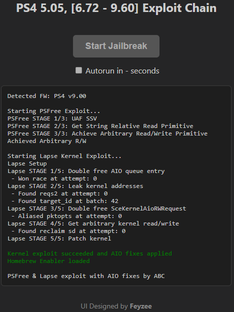

# Multi-Firmware PS4 WebKit & Kernel Exploit Chain

An exploit chain for PS4 firmware 5.05, 6.72 and [7.00 to 9.60]
> ⚠️ This repository is for research and educational purposes only.

> 🚧 **Beta / Work in Progress**
>
> This project is still under active development and beta testing. Firmware-specific issues may occur.

## Overview

This repository is a research-focused fork and consolidation of multiple public exploit projects. Its primary goal is to improve the reliability, stability and execution determinism of existing WebKit and kernel exploit chains across supported firmware versions.

The project focuses on:

- **Increasing stability and success rate** through refined timing control, improved error handling and sequential execution flow.

- **Reducing platform compatibility constraints** by converting the original `.mjs` modular structure into a plain `.js` implementation.

Additionally, the project utilizes **firmware-aware dynamic script loading** to ensure that only the required exploit stages are loaded at runtime. This approach improves timing consistency, reduces ES5/ES6 compatibility issues across firmware versions and enhances overall execution predictability.

  

---

## **Legal Notice & Disclaimer:**

- This repository does not host, or distribute any exploit hosting services
- Jailbreaking, circumventing security, or deploying exploits may be illegal in some jurisdictions.  
- It is your responsibility to ensure compliance with local laws.  
- The developer assumes **no responsibility** for any potential damage, data loss, or issues that may occur on your PlayStation console as a result of using this repository.  
- Use it at your own risk and only on your own devices.

## Major Changes

**[5.05]:**
- **Minor refinements** — improved status output using the existing WebKit logging system, applied small code optimizations and removed redundant code paths.

**[6.72]:**
- **Minor refinements** — improved status output using the existing WebKit logging system, applied small code optimizations and removed redundant code paths.
- **Minor adjust for entrypoint** — replaced try/catch-based success detection with a global state flag for cleaner execution flow.

**[7.00-9.60] PSFree & Lapse:**
- **Removed all** `.mjs` **files** — converted the codebase to plain `.js` to improve cross-platform compatibility and simplify loading requirements.
- **Refactored for more sequential** `C-like` **execution** — code reorganized to follow a linear flow for easier reasoning, deterministic timing, and simpler debugging.
- **Added initialization checks for variable operations** — guard checks ensure variables are initialized before use to prevent undefined-state failures.
- **Reordered and cleaned global variable initializations** — made global setup deterministic and reduced race conditions at startup.
- **Removed debugging logs** — cleaned up and commented out debugging logs to reduce side effects and improve runtime consistency.
- **Embedded** `.elf/.bin` **assets as shellcodes inside JS** — binary resources converted to in-file shellcodes to avoid read/load errors in constrained environments.
- **Modernized shellcode implementation** — adapted structural conventions from the BD-JB source and introduced a utility function to convert kpatch hex strings into byte arrays.
- **Merged various tweaks from Al-Azif’s source** — incorporated selected stability, compatibility, and workflow improvements from Al-Azif’s implementation to enhance overall reliability and reduce edge-case failures.
- **Reworked** `jitshm` **handling in the kpatch stage** — replaced the previous `write_fd` aliasing approach with direct `exec_fd` usage to simplify JIT shared memory management.
- **Minor adjustment to** `make_aliased_pktopts` **routine** — removed the repeated loop that previously attempted multiple alias creations. Failed retries could trigger kernel panic or immediate console shutdown. The updated routine now performs **a single attempt**; if it fails, the user is expected to restart from the system menu and retry safely. If you want to increase retry quantity, change the value `const pktopts_loopcnt = 1`.
- **Minor adjustment to kernel address leak scanning resolution** — reduced the offset increment step from `0x80` to `0x40` during the `leak_kernel_addrs` phase to increase detection accuracy and reduce the likelihood of missing valid structures.
- **Simlified payload loader function** — removed stub-based trampoline and switched to direct RWX payload execution.
- **GC handling improvements** — garbage collection handling within the PSFree stage has been refined to improve object scanning reliability. Memory layout adjustments were introduced to ensure that critical indices (including index 0) are properly scanned during GC traversal. This reduces the risk of unexpected object invalidation and increases exploit stability under memory pressure.
- **Stabilized failure handling via structured cleanup routine** — implemented a BD-JB-inspired `doCleanup()` function to properly release exploit resources before exit. Without this cleanup stage, failed attempts could leave the system in an unstable state, often triggering an immediate kernel panic and hard shutdown when attempting to restart. With proper resource unwinding, the console can now be safely restarted from the system menu, allowing clean retry attempts.
- **Increased modularity** — compared to my `psfree_lapse` repository, this project introduces a more modular architecture. Instead of relying on a single bundled `bundle.js` file, the exploit chain has been refactored into separate logical components like `helpers.js`, `psfree.js`, `kpatches.js` and `lapse.js`.
- **Dynamic script loading** — this project implements firmware-aware dynamic script loading. Rather than loading a monolithic bundle, exploit stages are injected at runtime based on firmware and execution state. This provides: Clear stage separation, Reduced cross-component side effects and Improved firmware-specific targeting.
- **BinLoader function** — The BinLoader function is activated on the second run of the exploit. After checking if the host is already jailbroken, the host starts the BinLoader and listens on port 9020. Send your payload using a compatible payload injector. My repo `psx_payload_injector` can also be used.

## ToDo List

- Investigate Lapse Stage 3 to improve success rate

## Notes:

> Firmware 7.00–9.60 includes integrated PSFree kernel patch shellcodes and **AIO patch sets**.

> All payload binaries (`*.bin`, `*.elf`) were intentionally excluded. This repository does not include `payload.bin` file. Place your preferred Homebrew Enabler (HEN) payload in the root directory.

> Step-by-step jailbreak instructions were omitted for legal and ethical compliance.

> No modifications that alter the exploit logic in ways affecting device security outside test context.

## Local Self-Hosting

You can self-host the project using Python's built-in HTTP server.

Windows: `py -m http.server 8080`

Linux/macOS: `python3 -m http.server 8080`

On your PS4 browser, navigate to: `http://YOUR_PC_IP:8080/index.html`

## Contributing

- Contributions are welcome! Feel free to open pull requests for bug fixes, UI improvements, or additional features.
- Due to my limited access to 5.05 and 6.72 firmware consoles, extensive success rate tuning has not been possible. Contributions focused on reliability improvements and success rate optimization for these firmwares are highly appreciated.

## License

This project continues under the same open-source license as the original PSFree repository (**AGPL-3.0**).  
Please review the [LICENSE](LICENSE) before redistributing or modifying the code.

## Acknowledgments

Special thanks to:

* **qwertyoruiopz**, Webkit Entrypoint for 5.05
* **Specter**, Kernel Exploit for 5.05
* **Fire30**, Bad Hoist Entrypoint for 6.7x
* **Sleirsgoevy**, Kernel Exploit for 6.7x
* **ABC**, PSFree and Lapse core software
* [KAR0218](https://github.com/KAR0218) for 5.05Gold project
* [ps3120](https://github.com/ps3120) for 6.72 project and reminding some tweaks for PSFree and Lapse.
* [kmeps4](https://github.com/kmeps4) and [Al-Azif](https://github.com/Al-Azif) for PSFree projects
* **ps4dev team** for their continuous support and invaluable contributions to the PS4 research ecosystem. This project stands on the hard work of all the developers behind it — none of this would be possible without their efforts.
* everyone who tested the updates across various firmware versions and supported the project with their valuable feedback.

Extra thanks to **Sajjad** for thoroughly testing supported firmware versions and dedicating an incredible amount of time and effort to ensure stability and reliability.

## Contact

For questions or issues, please open a GitHub issue on this repository.
